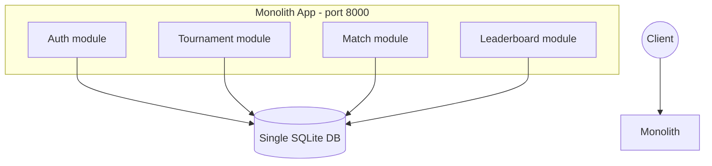
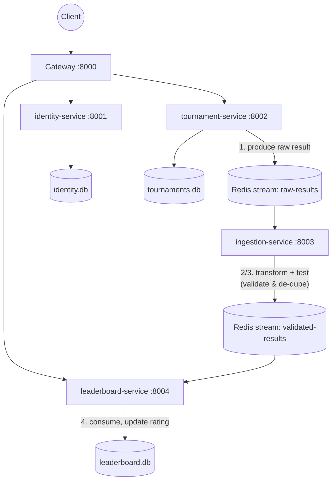

GitHub usernames: `Shhh09git` is Shattyk Kuziyeva, `AceMageddon` is
Daniil Glazunov.

# ClashArena — Software Architecture Final Documentation

Course: Software Architectures
Domain: online esports tournament platform (from the ClashArena kata)
Team: Daniil Glazunov (identity, integrity & security) · Shattyk Kuziyeva
(tournament format & scalability/elasticity)

Repository layout: this single repository contains **both** required
architectures, in `monolith/` and `microservices/`, plus this
documentation in `docs/`.

## 1. Introduction

ClashArena runs competitive video-game tournaments end to end: organisers
create tournaments, players register and get seeded into a bracket,
matches are played and results reported, ratings and a public leaderboard
update, and the system must stay responsive while spectator traffic
spikes by orders of magnitude during majors (see the kata document,
`Kata-Esports-Tournament-Platform.pdf`, for the full domain description).

To compare architectural styles, as required by the assignment, the same
subset of the domain — accounts, tournament creation, single-elimination
brackets, match result reporting, and a rating leaderboard — was built
twice:

- **`monolith/`** — one Flask application, one shared database.
- **`microservices/`** — five independently deployable services
  (`gateway`, `identity-service`, `tournament-service`,
  `ingestion-service`, `leaderboard-service`) communicating over HTTP and
  Redis Streams.

Both expose the same public API shape on port 8000, so the two systems
can be exercised with the exact same `curl` walkthrough.

## 2. Requirements and how to run

- Docker Desktop (or Docker Engine + Compose) installed.
- No other local dependencies — Python and all libraries run inside
  containers.

```bash
# Monolith
cd monolith && docker compose up --build      # -> http://localhost:8000

# Microservices
cd microservices && docker compose up --build # -> http://localhost:8000
```

Full curl walkthroughs are in `monolith/README.md` and
`microservices/README.md`. Kubernetes (minikube) instructions for the
distributed version are in `microservices/README.md` and
`microservices/k8s/`.

## 3. Technologies

| Concern | Technology |
|---|---|
| Language / framework | Python 3.11, Flask |
| ORM | Flask-SQLAlchemy |
| Database | SQLite (one shared file in the monolith; one file per service in the distributed version — chosen for a zero-install local demo; swapping in Postgres only changes `DATABASE_URL`) |
| Auth | Stateless JWT (PyJWT, HS256), passwords hashed with Werkzeug |
| Messaging (distributed only) | Redis Streams, used as the event log for the result-ingestion pipeline, with consumer groups for at-least-once delivery + de-duplication for effectively-once processing |
| Containerisation | Docker, Docker Compose |
| Orchestration (distributed only) | Kubernetes manifests (Deployment/Service/HorizontalPodAutoscaler) runnable on minikube |

## 4. Architecture characteristics driving the design

Derived from the kata (see docs/ClashArena-Architecture-Characteristics.pdf for the full derivation and kata references). These use the same ten characteristic names as that document, so the two deliverables agree:

| Characteristic | Target | How each architecture addresses it |
|---|---|---|
| Partitioning type | domain-driven boundaries, not technical layers | Monolith: one codebase, but internally organised by domain (auth/tournaments/matches/leaderboard modules). Distributed: literally separate services, one per domain, each owning its own database. |
| Simplicity | ease of understanding | Monolith clearly wins here — one codebase, one database, no network calls to reason about. This is the explicit trade-off we highlight in the conclusion. |
| Modularity | discrete, independently buildable components | Monolith: modules share one process and one database, so nothing is truly independent. Distributed: 5 independently buildable Docker images, zero shared schema. |
| Testability | results and dispute logic must be verifiable | Monolith: covered by 17 automated pytest tests (password hashing, JWT/RBAC, replay protection). Distributed: replay protection is enforced in two places — `tournament-service` refuses a second report of the same match with a 409, and `ingestion-service` de-duplicates on a deterministic `event_id` (`match-<id>-result`) so a redelivered stream message is also caught. The distributed path is verified manually via the curl walkthrough; not yet automated (future work). |
| Deployability | ease, frequency and risk of deployment | Monolith: one command, one container, healthy in under a minute. Distributed: one command, six containers, healthy in under two minutes; any single service can also be rebuilt and redeployed on its own. |
| Evolvability | ease of evolving the software | Monolith: any change means rebuilding and redeploying the whole app. Distributed: one service (e.g. `leaderboard-service`) can be changed, rebuilt and redeployed alone — demonstrated for real when we fixed a rating bug there without touching any other service. |
| Responsiveness | how quickly the software replies | Monolith: synchronous, in-process — a reported result and its rating update happen in the same request. Distributed: asynchronous — a result flows through Redis before the leaderboard sees it, adding latency (sub-second in our own manual testing; not formally load tested). |
| Scalability | sustain steady growth in accounts/events | Monolith: vertical scaling / running identical replicas behind a load balancer, but the database remains a single bottleneck. Distributed: each service scales to its own load profile; each owns its own database. |
| Elasticity | absorb a spectator/read burst without manual intervention | Monolith: none — the whole app scales as one unit, so a read spike forces scaling everything, including the write path. Distributed: `leaderboard-service` (pure read + stream consumer) is designed to scale independently via `--scale` / a Kubernetes HPA — see the known limitation below regarding correctness at more than 1 replica. |
| Fault tolerance | a failing component shouldn't take down read surfaces; results shouldn't be lost or double-counted | Monolith: one process — if it fails, everything fails, but within a single request a result and its rating update are atomic (trivially consistent). Distributed: `ingestion-service` de-duplicates by `event_id`, and Redis consumer groups mean an unacknowledged message stays in the pending list rather than being silently dropped. Note that we do not yet reclaim those pending entries (`XAUTOCLAIM`), so a worker that dies mid-message leaves that result stuck — recovering it is listed as future work in §9. `leaderboard-service` keeps answering reads even if `tournament-service` is down (verified directly). |

Security (JWT authentication, RBAC on every write endpoint) is not one of the course's twelve characteristics, so it isn't a row above — it's covered as a cross-cutting concern in §6 instead.

This table is the core deliverable of comparing the two styles: the
monolith is simpler and trivially consistent; the distributed version
buys elasticity, fault isolation and independent deployability, at the
cost of operational complexity — a message broker to run, eventual
consistency between the write path and the leaderboard, and more moving
parts to keep healthy.

## 5. Architectures

### 5.1 Monolith



One process, one database, one transaction boundary. A reported match
result updates the match row and both players' ratings synchronously —
there is no possibility of the leaderboard being stale relative to the
bracket, but also no way to scale the leaderboard reads independently of
the write path.

### 5.2 Microservices



This is a direct implementation of the pipeline the kata calls out
explicitly (§2.4, "forward pointer"): *game servers produce raw results,
a transformer normalises them, a tester validates and de-duplicates, a
consumer publishes standings/ratings*. Here, `tournament-service` plays
the producer role (an organiser reporting a result stands in for an
external game server callback), `ingestion-service` is the
transformer+tester, and `leaderboard-service` is the consumer.

Each service owns its data exclusively — `leaderboard-service` never
queries `tournament-service`'s database, only the validated event stream.
This is what allows it to be scaled, deployed and to fail independently.

## 6. Security

- Passwords are never stored in plaintext (Werkzeug `generate_password_hash`
  / `check_password_hash`, salted).
- Authentication is stateless JWT (HS256), carrying `sub` (user id) and
  `role`. Every service that needs to authorise a request verifies the
  signature locally — no additional network round-trip to identity-service
  is required just to validate a token.
- Authorisation (RBAC): tournament creation, starting a tournament, and
  reporting a result are restricted to `organizer` / `admin` roles via a
  `require_auth(roles=[...])` decorator, checked on every write endpoint.
- Result integrity: a match can only be reported once
  (`status == "reported"` short-circuits further writes), and in the
  distributed version each event carries a deterministic `event_id`
  (`match-<id>-result`) that `ingestion-service` de-duplicates against
  before it is ever counted
  — satisfying the kata's "tamper-resistant, auditable results" requirement
  at the pipeline level.
- Not yet implemented (documented as future work, see §9): encryption at
  rest for the database files, HTTPS termination (would sit at the
  gateway / a reverse proxy in front of it), and a full audit log of
  moderator actions (bans, result reversals).

## 7. Design patterns and code organization

- **Repository shape mirrors the architecture**: the monolith is one
  Flask app with domain concerns kept in clearly separated sections of a
  single file (would become Flask blueprints in a larger codebase); the
  distributed version has one folder = one deployable service = one
  Dockerfile.
- **Database-per-service** (distributed only): enforced by giving each
  service its own SQLAlchemy models and its own SQLite file — there is no
  shared schema to accidentally couple services together.
- **Event-driven pipeline** (distributed only): Redis Streams model the
  kata's producer → transformer → tester → consumer chain explicitly as
  data, rather than as direct service-to-service calls, which is what
  lets `ingestion-service` and `leaderboard-service` be scaled
  independently and be restarted without losing in-flight results.
- **API Gateway** (distributed only): a thin reverse proxy so clients
  have one stable entrypoint/port regardless of how the backend is split.

## 8. Testing and verification

Verification splits into one automated suite and three manual procedures.
The split is deliberate rather than aspirational: the security and
integrity rules are properties of a single process and can be asserted
cheaply in CI, whereas the distributed characteristics need a running
multi-container stack and are exercised by hand.

### 8.1 Automated tests

`monolith/tests/test_auth.py` — 17 tests over the identity and integrity
module. They use an in-memory SQLite database and need neither Docker nor
a running server. Run them with:

```bash
cd monolith
pip install -r requirements.txt pytest
python -m pytest tests/ -v
```

| Group | What is asserted |
|---|---|
| Password storage | The plaintext never appears in the stored hash; two users with the same password get different hashes (proving the per-user salt); a weak password and an unknown role are refused |
| Credential handling | An unknown username and a wrong password return byte-identical responses, so the login endpoint cannot be used to enumerate accounts |
| Token integrity | A token whose `role` claim has been edited and re-signed with another key is refused; an `alg: "none"` token is refused; an expired token is refused |
| Claim contract | `sub` is an integer and `role` is present — the two claims `tournament-service` reads. This test is what stops a change here from silently breaking the distributed version |
| RBAC | A player creating a tournament gets 403, an organizer gets 201, and a missing token gets 401 — the 401/403 distinction is asserted, not just the failure |
| Result integrity | Reporting the same match twice returns 409 and leaves the leaderboard byte-identical to reporting it once; the winner must be one of the two players; `reported_by` and `reported_at` are recorded for the audit trail (R9) |

The replayed-result test is the automated form of the kata's central
integrity requirement (C3, R5), which was previously only checked by hand.

These tests run on every push via GitHub Actions
(`.github/workflows/tests.yml`), alongside a second job that builds the
monolith image and drives the same walkthrough over real HTTP —
asserting the 403 on a player creating a tournament, the 409 on a
replayed result, and the exact leaderboard values afterwards.

The distributed stack has no automated suite yet; extending the same
smoke test to `microservices/docker-compose.yml` is listed as future
work in §9.

### 8.2 Manual verification

These need `docker compose up --build` in the relevant folder.

- **Functional smoke test**: the `curl` walkthrough in each README
  exercises the full flow (register → login → create tournament →
  register players → start → report result → leaderboard) end to end.
  Both architectures serve the same paths on port 8000, so the same
  walkthrough validates either one.
- **Reliability (distributed)**: replay an identical `event_id` onto the
  `raw-results` stream and confirm `ingestion-service` reports it under
  `duplicates` while the leaderboard is unchanged — the "no loss, no
  double-count" target. Note that this guarantee depends on the
  `seen-event-ids` set surviving a restart, which is why Redis runs with
  `appendonly` and a persistent volume.
- **Fault tolerance (distributed)**: `docker compose stop
  tournament-service`, then confirm `GET /api/leaderboard` still returns
  200 from `leaderboard-service` and `POST /api/tournaments` returns a
  clean 503 from the gateway rather than a hang or a crash. The gateway's
  own `/healthz` stays 200 and reports the dead backend in its body — an
  orchestrator should not restart the gateway because something behind it
  is down.
- **Scalability (distributed)**: `docker compose up --scale
  ingestion-service=3` and confirm results are still processed exactly
  once, which the Redis consumer group guarantees even with multiple
  workers competing for the same messages.

### 8.3 Known gaps

No load testing was performed, so the responsiveness targets (p95 read
latency) and the elasticity target (2→10 replicas under a spectator burst)
are designed-for rather than measured — stated plainly here and in the
architecture-characteristics document rather than presented as verified.
`tournament-service` and the monolith also currently run Flask's
development server; a production deployment would need a WSGI server such
as gunicorn, and `tournament-service` additionally runs with `debug=True`,
which exposes the Werkzeug debugger and should be disabled.

## 9. Conclusion and future work

Building the same domain twice makes the trade-off concrete rather than
theoretical: the monolith is dramatically simpler to run, reason about
and keep consistent, at the cost of scaling and deploying as a single
unit. The microservices version buys independent scaling (critical for
the kata's spectator-burst elasticity requirement) and fault isolation,
at the cost of needing a message broker, accepting eventual consistency
between the write path and the leaderboard, and more infrastructure to
operate.

Future work: an `XAUTOCLAIM` reclaim loop so a crashed stream worker's
pending message is picked up by another replica, Postgres instead of
SQLite for real concurrent load,
HTTPS/TLS termination at the gateway, a proper audit trail for
moderator actions (ban, result reversal), and extending the existing
GitHub Actions pipeline — which already runs the unit suite and an
end-to-end smoke test against the monolith stack — to cover the
distributed stack as well.

## Appendix A — API reference (identical surface on both architectures)

| Method | Path | Auth | Purpose |
|---|---|---|---|
| POST | `/api/register` | – | create account |
| POST | `/api/login` | – | get a JWT |
| POST | `/api/tournaments` | organizer/admin | create tournament |
| POST | `/api/tournaments/:id/register` | any | join a tournament |
| POST | `/api/tournaments/:id/start` | organizer/admin | generate bracket |
| GET | `/api/tournaments/:id/bracket` | – | view bracket |
| POST | `/api/matches/:id/result` | organizer/admin | report a result |
| GET | `/api/leaderboard` | – | top ratings |
| GET | `/healthz` | – | health check (per service in the distributed version) |

## Appendix B — Repository structure

```
clasharena/
├── docs/
│   └── ARCHITECTURE.md          <- this file
├── monolith/
│   ├── app.py
│   ├── requirements.txt
│   ├── Dockerfile
│   ├── docker-compose.yml
│   └── README.md
└── microservices/
    ├── gateway/
    ├── identity-service/
    ├── tournament-service/
    ├── ingestion-service/
    ├── leaderboard-service/
    ├── k8s/
    │   └── leaderboard-service.yaml
    ├── docker-compose.yml
    └── README.md
```

## AI usage transparency

Per the course policy on generative AI, here's how we used it: Claude
(Anthropic) scaffolded the first version of both architectures from
our kata (monolith and the microservices split with the Redis
result-ingestion pipeline) and drafted the initial documentation, and
helped us debug issues as we hit them (Docker/VPN cert errors, port
conflicts, a real application bug).

What we did ourselves: ran the full system end to end multiple times,
found and fixed a real bug in `leaderboard-service` (a crash on new
players' rating entries — see `microservices/evidence-bugfix.txt`),
tested fault tolerance and reliability manually, split and reviewed
the code by domain (Daniil: identity/security; Shattyk:
tournament/scalability) on our own branches with real pull requests,
and made the actual architecture-characteristic decisions ourselves.

## Known limitation: leaderboard-service does not scale correctly yet

`leaderboard-service` is the characteristic's headline example (its
Kubernetes manifest scales it 2→10 replicas via an HPA), but scaling
it beyond 1 replica is currently **broken**, for two reasons:

1. Each replica has its own local SQLite file (`sqlite:///leaderboard.db`),
   not a shared database. Replica A's writes are invisible to replica B.
2. All replicas share one Redis consumer group (`leaderboard-group`).
   A consumer group *distributes* messages — each event goes to exactly
   one replica, not all of them. So with 10 replicas, the 10 databases
   each hold a different, incomplete slice of the results, and
   `GET /api/leaderboard` returns whichever slice the replica that
   handled your request happens to know about.

In short: the exact scenario the elasticity target describes (scale to
10 replicas during a spectator burst) is where this breaks worst. At
`minReplicas: 2` it is already inconsistent.

**How we would fix it**, in increasing order of effort:

1. Split read and write roles: one `leaderboard-writer` (1 replica)
   consumes the stream and owns the database; a separate
   `leaderboard-reader` Deployment only serves `GET /api/leaderboard`
   against that same shared database, and is what the HPA actually
   scales. This matches the read/write split we already describe
   elsewhere in this document.
2. Give each replica its own consumer group name (e.g.
   `leaderboard-group-{HOSTNAME}`) so every replica sees every event
   and builds a complete local copy — cheaper to implement, but
   replicas can drift out of sync with each other over time.
3. Move rating state into Redis itself (e.g. a sorted set) so every
   replica reads from the same store instead of a local file.

We are documenting this rather than shipping a fix we haven't tested,
since we would rather be explicit about a limitation we understand
than claim a scaling story that doesn't hold up under inspection.
Related: this was previously worsened by the fact that no microservice
mounted a volume, so all data was lost on `docker compose down`. That
is now fixed — each service has a named volume — but persistence alone
doesn't solve the replica-drift problem above, since each replica
still has its own file.

